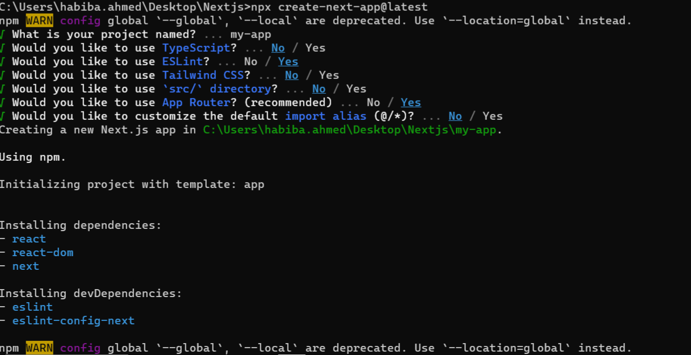

This is a ReadMe.md file explaining [Next.js](https://nextjs.org/)

# Getting Started

To create a new Nextjs project folder:
`npx create-next-app@latest`



#### To install packaged needed:

```npm install```

#### To run the development server:

```bash
npm run dev
# or
yarn dev
# or
pnpm dev
# or
bun dev
```

Open [http://localhost:3000](http://localhost:3000) with your browser to see the result.

```
nextjs project file
 |___ package.json #show our dependencies
 |___ next.config.mjs #write nextjs configurations
 |___ jsconfig.json #default path. Note  @ in here means I can import using @ instead of nested import /../../
 |___ eslintrc.json #eslint rules
 |___ public #This folder contains static assets like images, which can be served directly. 
```

### App Router
It allows to navigate between our pages easily, in react we need a library and some configurations to do that in nextjs we are able to do this by using app folder, and  we can create all our pages using this app directory 

You can start editing the page by modifying `app/page.jsx`. The page auto-updates as you edit the file.

This project uses [`next/font`](https://nextjs.org/docs/basic-features/font-optimization) to automatically optimize and
load Inter, a custom Google Font.

## Learn More

To learn more about Next.js, take a look at the following resources:

- [Next.js Documentation](https://nextjs.org/docs) - learn about Next.js features and API.
- [Learn Next.js](https://nextjs.org/learn) - an interactive Next.js tutorial.

You can check out [the Next.js GitHub repository](https://github.com/vercel/next.js/) - your feedback and contributions
are welcome!

## Deploy on Vercel

The easiest way to deploy your Next.js app is to use
the [Vercel Platform](https://vercel.com/new?utm_medium=default-template&filter=next.js&utm_source=create-next-app&utm_campaign=create-next-app-readme)
from the creators of Next.js.

Check out our [Next.js deployment documentation](https://nextjs.org/docs/deployment) for more details.
